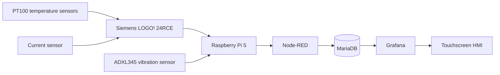
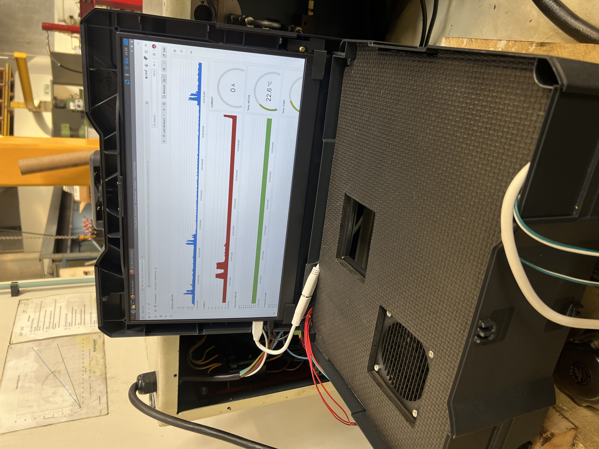
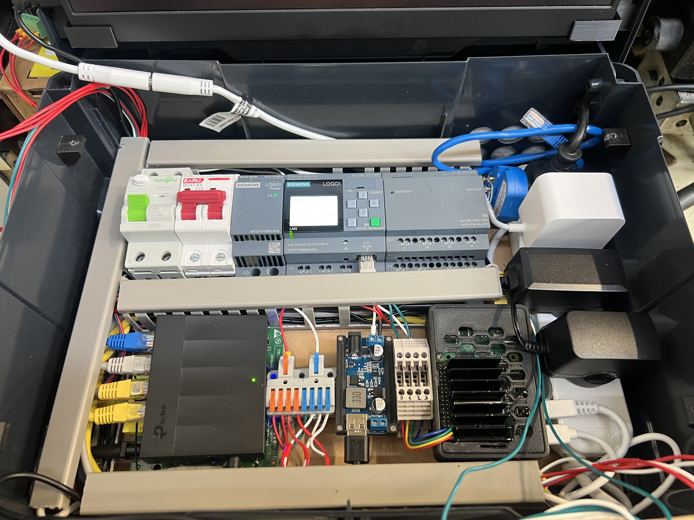
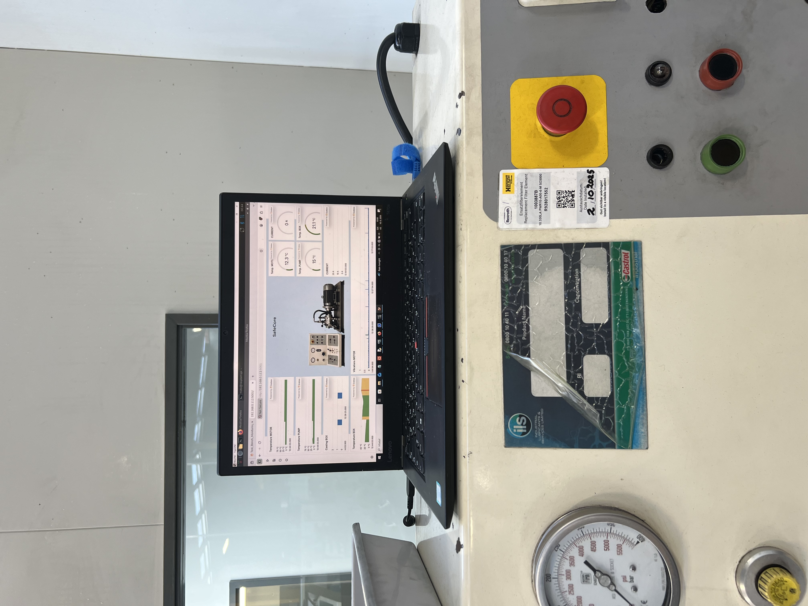

# SafeCore Industrial Monitoring System

SafeCore is a compact industrial monitoring and data-logging project built with a Siemens LOGO! PLC and a Raspberry Pi 5.

The system reads machine-condition data, stores it in MariaDB and displays live and historical values in Grafana on a touchscreen display.

This project is focused only on monitoring and data collection.

## Main functions

- Temperature monitoring of the enclosure, motor and pump
- Motor-current monitoring
- Vibration monitoring with an ADXL345 sensor
- Automatic enclosure cooling above 40.2 °C
- Data collection with Node-RED
- Historical data storage in MariaDB
- Live and historical Grafana dashboards
- Local display on a touchscreen connected to the Raspberry Pi

## System architecture

## Hardware

- Siemens LOGO! 24RCE
- Raspberry Pi 5
- Touchscreen display
- PT100 enclosure-temperature sensor
- PT100 motor-temperature sensor
- PT100 pump-temperature sensor
- Current sensor
- ADXL345 vibration sensor
- Ethernet switch
- Enclosure cooling fan
- USB switching module controlled by LOGO! output Q1
- Electrical protection and power-distribution components

## Software

### Siemens LOGO! Soft Comfort

The LOGO! program reads and processes temperature and current signals.

It also controls the enclosure cooling fan. When the enclosure temperature rises above 40.2 °C, output Q1 activates the USB switching module and starts the fan.

### Node-RED

Node-RED runs on the Raspberry Pi and performs the main data-acquisition tasks:

- Reads values from the Siemens LOGO! PLC
- Processes monitoring values
- Adds timestamps
- Writes records to MariaDB
- Connects the monitoring system to Grafana

### MariaDB

MariaDB stores the historical monitoring data.

#### Table: `test_bench_monitoring1`

- `id`
- `timestamp`
- `temp_box`
- `temp_motor`
- `temp_pump`
- `current_amp`
- `box_ccooling`

#### Table: `vibration_data`

- `id`
- `timestamp`
- `vibration`

### Grafana

Grafana displays the collected data as live and historical dashboards.

The dashboard includes:

- Motor vibration
- Motor current
- Motor temperature
- Pump temperature
- Enclosure temperature
- Cooling-fan status

## How the system works

1. PT100 sensors and the current sensor send monitoring values to the Siemens LOGO! PLC.
2. The Raspberry Pi reads the PLC data through Node-RED.
3. The ADXL345 vibration sensor sends vibration data directly to the Raspberry Pi.
4. Node-RED stores the monitoring values in MariaDB.
5. Grafana reads the database and displays the values on the touchscreen.
6. Historical data remains available for later analysis.

## Project images

### SafeCore monitoring box

### Internal components

### Monitoring system installed on the test bench

## Project status

The current prototype provides:

- Working PLC data acquisition
- Temperature, current and vibration monitoring
- MariaDB historical storage
- Grafana visualisation
- Automatic enclosure cooling
- Raspberry Pi touchscreen display

## Author

Matej Kockovsky
