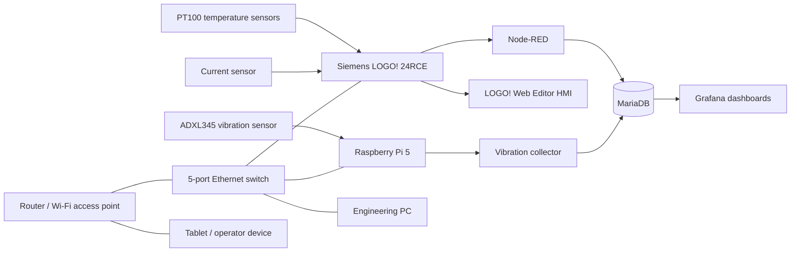

# SafeCore Monitoring and Data Collection

**Portable industrial monitoring, data-acquisition and visualisation platform for hydraulic test-bench equipment**


---

## Overview

SafeCore is a portable industrial monitoring and data-collection system developed for a hydraulic-cylinder test bench. It combines a Siemens LOGO! controller, Raspberry Pi 5, Node-RED, MariaDB, Grafana and a browser-based LOGO! Web Editor HMI in one transportable enclosure.

The project demonstrates practical integration of:

- PLC programming and industrial control;
- analogue and digital signal acquisition;
- industrial Ethernet networking;
- embedded Linux and Raspberry Pi;
- real-time data collection;
- historical database storage;
- dashboard visualisation;
- local browser-based HMI;
- Docker-based software deployment.

SafeCore is an engineering and university portfolio project. It is not presented as a certified commercial machine-safety system.

---

## Main functions

- Motor-temperature monitoring
- Pump-temperature monitoring
- Enclosure-temperature monitoring
- Motor-current monitoring
- ADXL345 vibration monitoring
- Automatic enclosure cooling
- Historical data storage in MariaDB
- Real-time and historical Grafana dashboards
- Siemens LOGO! Web Editor HMI
- Local Ethernet and Wi-Fi access through a dedicated LAN
- CSV export for data analysis
- Docker deployment for Raspberry Pi services

---

## System architecture



### Data flow

```text
PT100 sensors + current sensor
│
â–¼
Siemens LOGO! 24RCE
│
â–¼
Node-RED
│
â–¼
MariaDB
│
â–¼
Grafana

ADXL345 vibration sensor
│
â–¼
Raspberry Pi 5
│
â–¼
vibration_data table
```

---

## Hardware

### Controller

**Siemens LOGO! 24RCE**

Responsibilities:

- acquisition of analogue and digital signals;
- PT100 and current-sensor scaling;
- local control logic;
- manual and automatic operating modes;
- extend and retract command logic;
- timer and delay processing;
- output interlocks;
- enclosure-temperature supervision;
- automatic cooling control;
- variable-memory mapping for LWE;
- communication values used by Node-RED.

### Edge server

**Raspberry Pi 5**

Responsibilities:

- Node-RED runtime;
- MariaDB database;
- Grafana server;
- ADXL345 vibration acquisition;
- Docker host;
- local touchscreen interface;
- engineering and service access.

### Sensors

- PT100 enclosure-temperature sensor
- PT100 motor-temperature sensor
- PT100 pump-temperature sensor
- ADXL345 vibration sensor
- Motor-current sensor
- Digital cooling-state feedback

### Network

- Dedicated router / Wi-Fi access point
- 5-port Ethernet switch
- Siemens LOGO! Ethernet connection
- Raspberry Pi Ethernet connection
- Engineering PC connection
- Tablet access to LWE and dashboards
- Independent SafeCore LAN

### Electrical protection and enclosure equipment

- Residual-current protection device
- Miniature circuit breaker
- 24 V DC power distribution
- DIN-rail terminal blocks
- Raspberry Pi power supply
- Integrated touchscreen display
- Enclosure ventilation fan
- USB switching module controlled by LOGO! output Q1
- Portable protective enclosure

---

## Automatic enclosure cooling

SafeCore contains a local enclosure-temperature protection function implemented in the Siemens LOGO! program.

```text
Enclosure PT100 temperature
│
â–¼
Threshold: 40.2 °C
│
â–¼
LOGO! output Q1
│
â–¼
USB switching module
│
â–¼
Cooling fan ON
```

When the enclosure temperature rises above **40.2 °C**, LOGO! output **Q1** activates the USB switching module and powers the cooling fan.

The cooling state is also stored in MariaDB and displayed in Grafana.

This function remains inside the PLC and does not depend on Node-RED, MariaDB or Grafana.

---

## Siemens LOGO! Soft Comfort program

The LOGO! project contains the machine-monitoring and local-control logic, including:

- analogue-input acquisition;
- PT100 scaling;
- current-sensor scaling;
- pressure and timing value processing;
- manual and automatic modes;
- extend and retract requests;
- interlocks between opposing commands;
- delay timers;
- remaining-time values;
- digital output control;
- enclosure-cooling control;
- LWE variable-memory mapping;
- communication values used by Node-RED.

Store the engineering project here:

```text
logo/SafeCore_Test_Bench.lsc
```

---

## LOGO! Web Editor HMI

The operator interface is served directly by the LOGO! web server.

Typical local address:

```text
http://192.168.0.3/webroot/main.htm
```

The current HMI contains:

- TEST selector
- MANUAL / AUTO selector
- STOP command
- Pressure setpoint
- Actual pressure
- Time setting
- Time remaining
- EXTEND VALVE
- RETRACT VALVE
- EXTEND CYLINDER
- RETRACT CYLINDER
- STOP EXTEND
- STOP RETRACT
- Status indicators

Store the exported LWE project here:

```text
logo/lwe/
```

---

## Node-RED

Node-RED is the communication and data-routing layer between the PLC and MariaDB.

Responsibilities:

- reading values from Siemens LOGO!;
- converting raw PLC values into engineering units;
- attaching timestamps;
- validating data;
- preparing database inserts;
- writing process records to MariaDB;
- providing debug and diagnostic information.

Store the exported flow here:

```text
node-red/data/flows.json
```

Do not publish real passwords or credential secrets.

---

## MariaDB

MariaDB provides persistent historical storage.

### Process-monitoring table

Current table:

```text
test_bench_monitoring1
```

| Column | Description |
|---|---|
| `id` | Unique row identifier |
| `timestamp` | Sample date and time |
| `temp_box` | Enclosure temperature |
| `temp_motor` | Motor temperature |
| `temp_pump` | Pump temperature |
| `current_amp` | Motor current |
| `box_ccooling` | Cooling status |

### Vibration table

Current table:

```text
vibration_data
```

| Column | Description |
|---|---|
| `id` | Unique row identifier |
| `timestamp` | Sample date and time |
| `vibration` | ADXL345 vibration value |

Export the exact schema from the working Raspberry Pi installation to:

```text
mariadb/init/01_schema.sql
```

---

## Grafana

Grafana is the monitoring and diagnostics layer.

The current dashboard includes:

- motor-vibration trend;
- motor-current trend;
- current gauge;
- motor-temperature trend and gauge;
- pump-temperature trend and gauge;
- enclosure-temperature trend;
- enclosure-cooling status;
- selectable time range;
- automatic refresh;
- historical review.

Export the dashboard JSON to:

```text
grafana/dashboards/safecore-dashboard.json
```

---

## Docker deployment

The Raspberry Pi software stack is deployed with Docker Compose.

### Containerised services

- Node-RED
- MariaDB
- Grafana

The Siemens LOGO! program and LWE project are not Docker containers. They run inside the LOGO! controller and are stored in this repository as engineering files.

The ADXL345 collector should be containerised only after the exact working Raspberry Pi acquisition script has been copied and tested with access to `/dev/i2c-1`.

### Start

```bash
cp .env.example .env
docker compose up -d
docker compose ps
```

### Stop

```bash
docker compose down
```

### Logs

```bash
docker compose logs -f
```

---

## Repository structure

```text
SafeCore/
├── README.md
├── docker-compose.yml
├── .env.example
├── DOCKER_MIGRATION_CHECKLIST.md
├── logo/
│ ├── SafeCore_Test_Bench.lsc
│ └── lwe/
├── node-red/
│ └── data/
│ ├── flows.json
│ ├── flows_cred.json
│ └── package.json
├── mariadb/
│ └── init/
│ └── 01_schema.sql
├── grafana/
│ ├── dashboards/
│ │ └── safecore-dashboard.json
│ └── provisioning/
│ ├── dashboards/
│ └── datasources/
└── docs/
└── images/
```

---

## Screenshots

### SafeCore monitoring enclosure


### Internal electrical and control layout


### Installation on the hydraulic test bench


### LOGO! Web Editor HMI


### Node-RED acquisition flow


### MariaDB historical records


### Grafana dashboard


### Docker containers


---

## Example network configuration

| Device | Example address |
|---|---:|
| Router / gateway | `192.168.0.1` |
| Siemens LOGO! | `192.168.0.3` |
| Raspberry Pi 5 | `192.168.0.10` |
| Engineering PC | DHCP or static |
| Tablet | DHCP |

All devices must be connected to the same SafeCore LAN to access LWE, Grafana, Node-RED and the Raspberry Pi.

---

## Operating concept

1. Power the SafeCore enclosure.
2. The router creates the SafeCore LAN.
3. LOGO! starts its monitoring and local-control program.
4. Docker starts Node-RED, MariaDB and Grafana on the Raspberry Pi.
5. Node-RED collects PLC data and writes it to MariaDB.
6. The vibration collector writes ADXL345 data to MariaDB.
7. Grafana displays real-time and historical data.
8. The operator accesses LWE from the integrated display, PC or tablet.

---

## Implemented and tested functions

- Siemens LOGO! signal acquisition
- PT100 temperature monitoring
- Motor-current monitoring
- ADXL345 vibration acquisition
- Node-RED data collection
- MariaDB historical storage
- Grafana visualisation
- Enclosure-temperature supervision
- Automatic fan activation above 40.2 °C
- Ethernet communication
- Local browser-based HMI
- Remote Raspberry Pi service access
- CSV export for analytics

Docker packaging is the deployment stage of the existing Raspberry Pi system. Before publishing a release, the exact Node-RED dependencies, MariaDB schema, Grafana dashboard and vibration-collector code must be exported from the current installation and tested inside the containers.

---

## Safety notice

SafeCore is an educational and engineering prototype.

It is not a certified safety controller and must not be used as the sole protective system for hydraulic machinery.

Emergency stopping, pressure limitation, guarding, electrical protection and other safety functions must be implemented with appropriate safety-rated hardware and verified by a competent person.

---

## Author

**Matej Kockovsky**

Industrial monitoring, automation and software-integration project.
